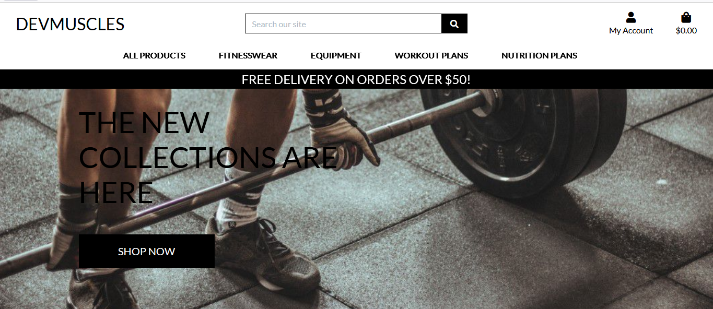

# Milestone-Project-4

<strong>Milestone Project </strong>

<strong>Full Stack Framework With Django</strong> 

<strong>Code Institute</strong>

<strong>DevMuscles</strong> 

An online commerce site where users can buy items relating to fitness(fitnesswear, equipment, plans etc).
The project has a couple of pages:

1:A homepage that allows users to search for items relating to fitness, and view the products in detail.

2:A login page where users can either login or register for an account.

3:Profile page where the user can update their delivery details and see the orders they have made on the site.

4:Page where the admin can edit/delete products that were created on the site.

5:Page where the admin of the site can add or edit categories.

[Link to website](https://milestone-project-four-muscles.herokuapp.com/) here to see the website.

## Table of Contents
> - [UX](#ux)
> - [User Stories](#user-stories)
> - [Strategy](#strategy)
> - [Scope](#scope)
> - [Structure](#structure)
> - [Surface](#surface)
> - [Icons](#icons)
> - [Skeleton](#wireframes)
> - [Features](#features)
> - [Features Left to Implement](#features-left-to-implement)
> - [Technologies Used](#technologies-used)
> - [Libraries](#libraries)
> - [Version Control](#version-control)
> - [Other](#other)
> - [Testing](#testing)
> - [Deployment](#deployment)
> - [Credits](#credits)
> - [Acknowledgments](#acknowledgments)

## UX:

## User Stories:

## Strategy:

## Scope:

## Structure:

## Surface:

## Icons:

                               
## Features:

<strong>Existing Features:</strong>

## Features Left to Implement:

## Technologies Used:

## Libraries:

## Version Control:

## Other:

## Testing:

## Deployment:

## Credits:

## Content:
All text content in this website was written by me.

## Media:
The photos used in this site were obtained from:

Homepage background gotten<a href="https://www.google.com/search?hl=en-IE&tbs=simg:CAQSiQIJPpcIGl5sbUYa_1QELELCMpwgaOgo4CAQSFM0hvTL-PK84iw--HokslR36IeAeGhrv4gxneoTp6JfsCfEo0i-klwsaeYO-5uiihCAFMAQMCxCOrv4IGgoKCAgBEgRrIAfMDAsQne3BCRqdAQojCg9mcmVlIHdlaWdodCBiYXLapYj2AwwKCi9tLzBoOG00YmYKGgoHYmFyYmVsbNqliPYDCwoJL20vMDNfMTYzChkKB3dlaWdodHPapYj2AwoKCC9tLzBoenN2Ch8KC2FjdGl2ZSB0YW5r2qWI9gMMCgovbS8waGdudGd3Ch4KDHBvd2VybGlmdGluZ9qliPYDCgoIL20vMGg1dDQM&q=person+lifting+weights&tbm=isch&sa=X&ved=2ahUKEwj_n_yX86f0AhWUoFwKHUt7BvQQwg4oAHoECAEQMg&biw=1366&bih=587&dpr=1>here</a>

Xenios USA Fitness Dumbbells gotten<a href="https://www.xeniosusa.com/en/pair-of-fitness-dumbbell.html">here</a>

Water Bottle gotten<a href="https://eu.gymshark.com/products/gymshark-fruit-infuser-black">here</a>

Skipping Rope gotten<a href="https://eu.gymshark.com/products/gymshark-skipping-rope-black">here</a>

Arrival 5 Shorts gotten<a href="https://eu.gymshark.com/products/gymshark-arrival-5-shorts-black-aw21">here</a>

Fit Seamless Shorts gotten<a href="https://eu.gymshark.com/products/gymshark-fit-shorts-black-white">here</a>

Sports Bra gotten<a href="https://www.decathlon.ie/bras/309915-72862-women-s-cotton-sports-bra-black.html">here</a>

30 Day Strength Traning gotten<a href="https://www.nbcnews.com/better/lifestyle/30-day-strength-training-routine-no-equipment-required-ncna988936">here</a>

Warrior Workout gotten<a href="https://ukoutdoorfitness.com/bootcamp/total-warrior-workout-plan">here</a>

Cardio HIIT gotten<a href="https://www.shape.com/fitness/workouts/cardio-hiit-heart-rate-challenge">here</a>

30 Day Meal Plan gotten<a href="https://soreyfitness.com/fitness/masters-chisel-calendar-meal-plan/">here</a>

Vegan bodybuilding gotten<a href="https://www.vivolife.co.uk/blogs/news/a-nutritionist-s-guide-to-a-vegan-bodybuilding-diet">here</a>

Lean Muscle diet plan gotten<a href="https://healthyrecipesforweghtloss.blogspot.com/2019/08/best-7-day-diet-plan-for-weight-loss.html">here</a>
  
  
## Acknowledgments:
I received inspiration from an Bootstrap mini project that was taught to us as part of our course.